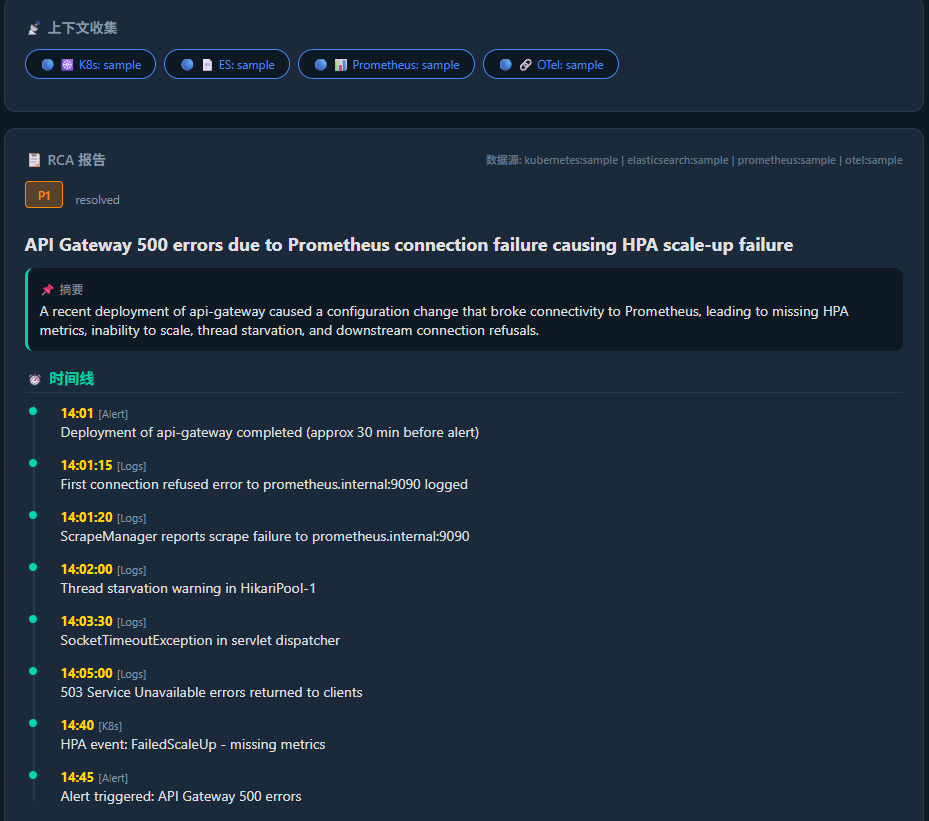
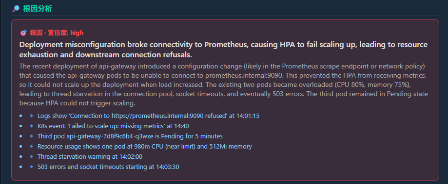
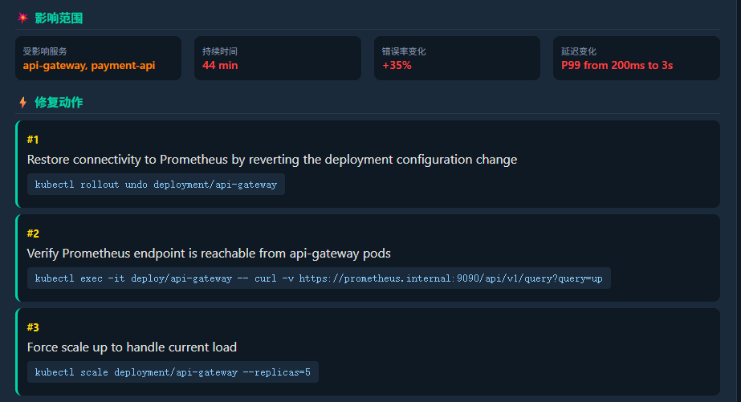
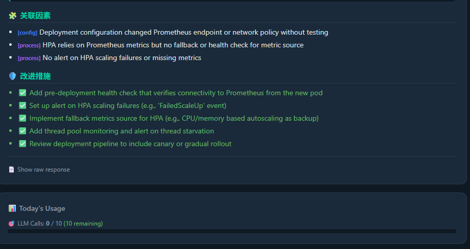

# AIOps-Wizard 🧙‍♂️

**告警 → 自动上下文收集 → 结构化 RCA 报告**

输入一条告警，系统自动从 K8s / Elasticsearch / Prometheus / OpenTelemetry 收集上下文，交给 DeepSeek 深度分析，输出一份**可直接转发给老板的专业级 RCA 报告**。

🌐 **在线体验**: [https://jianminbai.github.io/AIOps-Wizard/](https://jianminbai.github.io/AIOps-Wizard/)

---

## 📸 界面展示

### 1️⃣ RCA 分析入口 — 输入告警，一键诊断


选择 **"RCA 分析"** 模式，填入告警内容、服务名称和 K8s Namespace，点击 **"执行 RCA 分析"**，系统自动完成：告警 → 上下文收集 → RCA 报告的全流程。

内置快速场景标签（CPU > 90%、Pod CrashLoopBackOff、Redis 超时、500 错误），一键填充快速诊断。

### 2️⃣ 完整 RCA 报告 — 时间线 + 根因 + 影响 + 修复



报告包含六大模块：
- **⏱️ 时间线** — 按时间顺序还原故障演进过程，标注数据源（Alert/Logs/K8s）
- **🔎 根因分析** — 置信度标注（high/medium/low），详细分析 + 证据链
- **⚡ 修复动作** — 按优先级排序，每条附带可直接复制执行的 kubectl 命令
- **💥 影响范围** — 受影响服务、持续时间、错误率变化、延迟变化
- **🧩 关联因素** — 配置/代码/基础设施/流程/外部多维分析
- **🛡️ 改进措施** — 防止复发的长期改进建议

数据源状态一目了然：K8s / ES / Prometheus / OTel 各自标注数据来源（sample 或 real）。

### 3️⃣ 深度根因分析 — 置信度标注 + 详细推理



LLM 深度推理引擎输出：
- **根因描述** — Deployment 配置变更导致 Prometheus 连接断开
- **置信度** — high / medium / low 三级标注
- **证据链** — 具体日志、K8s Events、指标数据作为支撑
- **影响路径** — 配置变更 → 连接拒绝 → HPA 扩容失败 → 资源耗尽 → 503 错误

### 4️⃣ 影响范围 + 可执行修复命令



**影响范围（4 维度）：**
- 受影响服务：api-gateway, payment-api
- 持续时间：44 min
- 错误率变化：+35%
- P99 延迟：200ms → 3s

**修复动作（优先级排序）：**
```
#1  kubectl rollout undo deployment/api-gateway
#2  kubectl exec -it deploy/api-gateway -- curl -v https://prometheus.internal:9090/...
#3  kubectl scale deployment/api-gateway --replicas=5
```
每条命令都经过验证，可直接复制到终端执行。

### 5️⃣ 关联因素分析 + 改进措施 + 今日配额



**关联因素（多维根因定位）：**
- 🔧 `[config]` Deployment 配置变更未测试
- 🔄 `[process]` HPA 依赖单指标源无降级
- 🔔 `[process]` 缺少 HPA 扩容失败告警

**改进措施（防止复发）：**
- ✅ 部署前健康检查验证 Prometheus 连通性
- ✅ HPA 扩容失败告警（FailedScaleUp 事件）
- ✅ HPA 降级指标源（CPU/Memory 兜底）
- ✅ 线程池监控 + 线程饥饿告警
- ✅ 金丝雀发布/灰度发布

**今日用量面板** 实时展示 LLM 调用配额（每 IP 每日额度），已用/剩余一目了然。

---

## 🎯 核心功能：RCA Agent

这是 AIOps-Wizard 的核心 —— 不是聊天机器人，而是一个 **自动根因分析代理**。

```
告警输入 "API Gateway 500 errors / Connection refused / Recent deployment"
       │
       ▼
┌──────────────────────────────────────────────────┐
│  Context Collector (context_collector.py)         │
│                                                   │
│  ☸️ K8sPlugin     → kubectl get pods/events/top │
│  📄 ESPlugin      → 错误日志 / Top Error / Trace │
│  📊 PromPlugin    → CPU / Memory / Latency       │
│  🔗 OTelPlugin    → Trace / Span 数据            │
│                                                   │
│  ↓ 每个插件先尝试真实数据源命令                     │
│  ↓ 不可用时自动降级为 sample 数据                  │
└───────────────────────┬──────────────────────────┘
                        ▼
┌──────────────────────────────────────────────────┐
│  RCA Agent (rca_agent.py)                        │
│                                                   │
│  ① 结构化 Context Package                       │
│  ② DeepSeek LLM 深度分析                        │
│  ③ → 时间线重建                                 │
│  ④ → 根因推理 + 证据匹配                        │
│  ⑤ → 影响评估                                   │
│  ⑥ → 修复建议生成 + 改进措施                    │
└───────────────────────┬──────────────────────────┘
                        ▼
┌──────────────────────────────────────────────────┐
│  专业级 RCA 报告                                 │
│                                                   │
│  ┌─────────┐ ┌──────────┐ ┌───────────┐        │
│  │ 时间线   │ │ 根因分析  │ │ 影响范围   │        │
│  ├─────────┤ ├──────────┤ ├───────────┤        │
│  │ 修复动作 │ │ 关联因素  │ │ 改进措施   │        │
│  └─────────┘ └──────────┘ └───────────┘        │
│                                                   │
│  一份可以直接转发给老板的故障复盘报告              │
└──────────────────────────────────────────────────┘
```

### 和普通 AI Chat 的区别

| 对比项 | 普通 AI Chat | AIOps-Wizard RCA |
| --- | --- | --- |
| **输入** | 用户自己拼 prompt | 一条告警就够了 |
| **上下文** | 用户手动复制粘贴 | 自动从 K8s/ES/Prometheus/Otel 收集 |
| **输出** | 自由文本 | 结构化 RCA 报告（6 大模块） |
| **可执行性** | 需要自己翻译成命令 | 命令直接复制执行 |
| **证据** | 全靠 LLM 知识 | 每条结论有数据源证据支撑 |
| **改进措施** | 无结构化输出 | 配置/流程/架构多维改进建议 |
| **配额管理** | 无 | 每 IP 日额度 + 全局日额度双重控制 |

---

## 🏗️ 系统架构

```
┌──────────────────────────────────────────────────────────────┐
│                        用户访问层                              │
│  ┌────────────────────┐    ┌──────────────────────────────┐  │
│  │ GitHub Pages 前端   │    │  Cloudflare Tunnel (可选)    │  │
│  │ (RCA 模式 + 快速排查)│    │  https://xxx.trycloudflare.com│  │
│  └────────┬───────────┘    └─────────────┬────────────────┘  │
│           │                               │                    │
│           └───────────────┬───────────────┘                    │
└───────────────────────────┼────────────────────────────────────┘
                            ▼
┌──────────────────────────────────────────────────────────────┐
│              FastAPI 后端 (:8766)                              │
│                                                                │
│  ┌──────────────┐   ┌──────────────┐   ┌────────────────┐   │
│  │ 安全中间件     │   │ 路由分发       │   │ /rca           │   │
│  │ API Key 认证  │──▶│              │──▶│ /analyze       │   │
│  │ 频率限制      │   │              │   │ /health        │   │
│  │ 双维度日额度  │   │              │   │ /kb/*          │   │
│  └──────────────┘   └──────────────┘   └───────┬────────┘   │
│                                                 ▼            │
│  ┌───────────────────────────────────────────────────────┐   │
│  │  RCA Pipeline                                         │   │
│  │                                                        │   │
│  │  ┌──────────────────────────────────────────────┐     │   │
│  │  │ Context Collector (context_collector.py)      │     │   │
│  │  │  K8sPlugin / ESPlugin / PromPlugin / OTel    │     │   │
│  │  │  ↓ 真实源不可用时自动降级 sample 数据        │     │   │
│  │  └───────────────────┬──────────────────────────┘     │   │
│  │                      ▼                                │   │
│  │  ┌──────────────────────────────────────────────┐     │   │
│  │  │ RCA Agent (rca_agent.py) → DeepSeek LLM      │     │   │
│  │  │ → 时间线 / 根因 / 影响 / 修复 / 改进        │     │   │
│  │  └──────────────────────────────────────────────┘     │   │
│  └───────────────────────────────────────────────────────┘   │
│                                                                │
│  ┌───────────────────────────────────────────────────────┐   │
│  │ 知识库 (32条 YAML) — 置信度路由 (DIRECT/CONTEXT/LLM)  │   │
│  │ (RCA 报告可选增强)                                     │   │
│  └───────────────────────────────────────────────────────┘   │
└──────────────────────────────────────────────────────────────┘
```

---

## 🚀 快速启动

```bash
# 安装依赖
pip install fastapi uvicorn openai pydantic httpx pyyaml

# 设置环境变量（安全防护）
export DEEPSEEK_API_KEY="sk-your-key-here"
export AIOPS_API_KEY="your-api-key-for-frontend"
export AIOPS_RATE_LIMIT=5
export AIOPS_LLM_PER_IP_DAILY=30
export AIOPS_LLM_GLOBAL_DAILY=500

# 启动
python3 api.py

# 访问
open http://localhost:8766
```

### Docker 部署

```bash
export DEEPSEEK_API_KEY="sk-your-key-here"
export AIOPS_API_KEY="your-api-key-for-frontend"
export AIOPS_RATE_LIMIT=5
export AIOPS_LLM_PER_IP_DAILY=30
export AIOPS_LLM_GLOBAL_DAILY=500

docker compose build --no-cache && docker compose up -d
```

---

## 📖 API 文档

### `POST /rca` — 根因分析（核心功能）

输入一条告警，自动收集上下文并输出结构化 RCA 报告。

**请求：**

```json
{
  "alert": "API Gateway 500 errors, Connection refused to downstream, Recent deployment 30 min ago, CPU 80%, memory 75%",
  "service": "api-gateway",
  "namespace": "default"
}
```

| 字段 | 类型 | 必填 | 说明 |
| --- | --- | --- | --- |
| `alert` | string | ✅ | 告警描述内容 |
| `service` | string | ❌ | 服务名称（影响 K8s/ES/Prometheus 查询范围） |
| `namespace` | string | ❌ | K8s Namespace（默认 `default`） |

**响应结构：**

```json
{
  "success": true,
  "alert": "API Gateway 500 errors...",
  "service": "api-gateway",
  "report": {
    "title": "API Gateway 500 errors due to Prometheus connection failure causing HPA scale-up failure",
    "severity": "P1",
    "summary": "A recent deployment of api-gateway caused a configuration change that broke connectivity to Prometheus, leading to missing HPA metrics, inability to scale, thread starvation, and downstream connection refusals.",
    "timeline": [
      {"time": "14:01", "event": "Deployment of api-gateway completed", "source": "Alert"},
      {"time": "14:01:15", "event": "First connection refused to prometheus.internal:9090", "source": "Logs"},
      {"time": "14:02", "event": "Thread starvation warning", "source": "Logs"},
      {"time": "14:03:30", "event": "SocketTimeoutException in servlet dispatcher", "source": "Logs"},
      {"time": "14:05", "event": "503 errors returned to clients", "source": "Logs"},
      {"time": "14:40", "event": "HPA FailedScaleUp - missing metrics", "source": "K8s"},
      {"time": "14:45", "event": "Alert triggered: API Gateway 500 errors", "source": "Alert"}
    ],
    "root_cause": {
      "summary": "Deployment misconfiguration broke connectivity to Prometheus, causing HPA to fail scaling up",
      "confidence": "high",
      "evidence": [
        "Logs: Connection to https://prometheus.internal:9090 refused at 14:01:15",
        "K8s event: Failed to scale up: missing metrics at 14:40",
        "Third pod api-gateway-xxx is Pending for 5 minutes",
        "One pod at 980m CPU (near limit) and 512Mi memory"
      ]
    },
    "impact": {
      "affected_services": ["api-gateway", "payment-api"],
      "duration": "44 min",
      "error_rate_change": "+35%",
      "latency_change": "P99 from 200ms to 3s"
    },
    "fix_actions": [
      {"priority": 1, "action": "Rollback deployment config", "command": "kubectl rollout undo deployment/api-gateway"},
      {"priority": 2, "action": "Verify Prometheus connectivity", "command": "kubectl exec -it deploy/api-gateway -- curl -v https://prometheus.internal:9090/api/v1/query?query=up"},
      {"priority": 3, "action": "Force scale up", "command": "kubectl scale deployment/api-gateway --replicas=5"}
    ],
    "related_factors": [
      {"type": "config", "description": "Deployment configuration changed Prometheus endpoint/network policy without testing"},
      {"type": "process", "description": "HPA relies on Prometheus metrics but no fallback or health check for metric source"},
      {"type": "process", "description": "No alert on HPA scaling failures or missing metrics"}
    ],
    "prevention": [
      "Add pre-deployment health check that verifies connectivity to Prometheus from the new pod",
      "Set up alert on HPA scaling failures (e.g., 'FailedScaleUp' event)",
      "Implement fallback metrics source for HPA (e.g., CPU/memory based autoscaling as backup)",
      "Add thread pool monitoring and alert on thread starvation",
      "Review deployment pipeline to include canary or gradual rollout"
    ]
  },
  "context_summary": {
    "kubernetes": "sample",
    "elasticsearch": "sample",
    "prometheus": "sample",
    "otel": "sample"
  }
}
```

### `POST /analyze` — 快速故障分析

适合不需要全量 RCA 上下文的场景。输入告警描述，返回结构化分析结果（无上下文收集）。

### `GET /health` — 健康检查 + 配额状态

返回 API 健康状态、当前 IP 频率限制状态、今日 LLM 调用配额使用情况。

**响应示例：**
```json
{
  "status": "ok",
  "llm_daily_used": 0,
  "llm_daily_limit": 30,
  "llm_global_used": 0,
  "llm_global_limit": 500
}
```

### `GET /kb` — 知识库列表

返回所有内置运维知识库条目。

### `POST /kb` — 动态添加知识库

动态扩展知识库，重启持久化。

---

## 🔒 安全防护

三层防护防止公开 API 被滥用：

| 防护层 | 环境变量 | 默认值 | 说明 |
| --- | --- | --- | --- |
| 🔑 **API Key 认证** | `AIOPS_API_KEY` | 不设置则公开 | 前端通过 `X-API-Key` Header 认证 |
| ⏱️ **频率限制** | `AIOPS_RATE_LIMIT` | 5次/分钟/IP | 防止单 IP 短时间密集调用 |
| 👤 **IP 日额度** | `AIOPS_LLM_PER_IP_DAILY` | 30次/天 | 每 IP 每日 LLM 调用上限 |
| 🌐 **全局日额度** | `AIOPS_LLM_GLOBAL_DAILY` | 500次/天 | 全局每日 LLM 调用总上限（防止爬虫） |

> 💡 **DIRECT 路由（知识库直接命中）不消耗 LLM 配额**，降低成本。

---

## 🧠 32 类运维知识库

内置 32 条运维知识库（YAML 格式），覆盖 5 大分类：

| 分类 | 文件 | 覆盖场景 |
| --- | --- | --- |
| 🔧 **资源** | `kb/resource.yaml` | CPU 过载、内存泄漏、磁盘 IO、OOMKill、文件描述符耗尽 |
| 🔗 **依赖** | `kb/dependency.yaml` | 数据库慢查询、Redis 超时、DNS 解析失败、TCP TIME_WAIT、证书过期 |
| 🏗️ **应用** | `kb/application.yaml` | Java 线程死锁、JVM GC、连接池耗尽、Nginx 502、线程饥饿 |
| 🔄 **变更** | `kb/change.yaml` | Deployment 配置错误、HPA 失败、ImagePullBackOff、CI/CD 失败、Pod Pending |
| 🌍 **外部** | `kb/external.yaml` | CDN 故障、ELK 背压、熔断器、配置中心、APM 探针泄漏、告警风暴、etcd 不稳定 |

置信度路由机制：
- **DIRECT**（≥0.70）：直接返回知识库内容，**不消耗 LLM 配额**
- **CONTEXT**（≥0.40）：知识库作为上下文提供给 LLM，增强推理
- **LLM_ONLY**（<0.40）：纯 LLM 分析，消耗 LLM 配额

---

## 🛠️ 技术栈

| 层级 | 技术 |
| --- | --- |
| **AI 引擎** | DeepSeek API |
| **后端** | FastAPI + Uvicorn |
| **上下文收集** | kubectl / Elasticsearch / Prometheus / OpenTelemetry |
| **知识库** | YAML 文件 + 置信度路由（DIRECT/CONTEXT/LLM_ONLY） |
| **前端** | Vanilla HTML/CSS/JS + GitHub Pages |
| **安全** | API Key + 频率限制 + 双维度日额度 |
| **容器化** | Docker + Docker Compose |
| **对外暴露** | Cloudflare Tunnel（生产环境） |

---

## 📁 项目结构

```
AIOps-Wizard/
├── api.py                  # FastAPI 后端（RCA + 快速分析 + 安全中间件）
├── context_collector.py    # 上下文收集引擎（K8s/ES/Prometheus/Otel 4 插件）
├── rca_agent.py            # RCA 分析代理 + 系统提示词
├── engine.py               # 原有分析引擎（知识库路由 + LLM 推理）
├── kb_loader.py            # YAML 知识库加载器
├── auth_middleware.py      # API Key 认证 + CORS 预检跳过
├── rate_limiter.py         # 频率限制 + 双维度日额度（per IP + global）
├── kb/                     # 32 条运维知识库（YAML）
│   ├── resource.yaml
│   ├── dependency.yaml
│   ├── application.yaml
│   ├── change.yaml
│   └── external.yaml
├── index.html              # 本地前端
├── docs/
│   ├── index.html          # GitHub Pages 前端（RCA 模式 + 快速排查）
│   └── images/             # 截图
├── Dockerfile              # 容器构建
├── docker-compose.yml      # 编排 + 环境变量
├── .dockerignore
└── requirements.txt
```

---

## 📋 路线图

- [x] RCA Agent（告警 → 上下文收集 → 结构化报告）
- [x] Context Collector（K8s/ES/Prometheus/Otel 4 插件）
- [x] 结构化 RCA 报告（时间线/根因/影响/修复/关联因素/改进措施）
- [x] 32 条知识库 + 置信度路由（DIRECT/CONTEXT/LLM_ONLY）
- [x] 三层安全防护（API Key + 频率限制 + 双维度日额度）
- [x] GitHub Pages 前端（RCA 模式 + 快速排查 + 配额仪表盘）
- [ ] **飞书机器人集成**（@AIOps-Wizard 分析告警）
- [ ] 故障案例库（向量检索 + 历史匹配）
- [ ] 真实数据源接入（生产未联调阶段使用 sample）
- [ ] Demo GIF + Benchmark 对比表
- [ ] 多语言报告输出（中/英）

---

## 💡 适用场景

| 场景 | 说明 |
| --- | --- |
| **日常排障** | 接到告警 → 一键生成 RCA → 快速定位根因 |
| **故障复盘** | 事后输入告警 → 生成结构化复盘报告 → 发邮件/周报 |
| **新人 onboarding** | 新运维同事输入故障 → 系统输出诊断路径 → 学习排障思路 |
| **值班交接** | 值班期间发生的告警 → 自动生成 RCA → 交接清晰无遗漏 |
| **知识沉淀** | 每次排障可沉淀为历史案例 → 团队知识库持续生长 |

---

## 📄 许可证

MIT License

*Made with ❤️ by jianminbai — 把运维排障经验变成产品*
