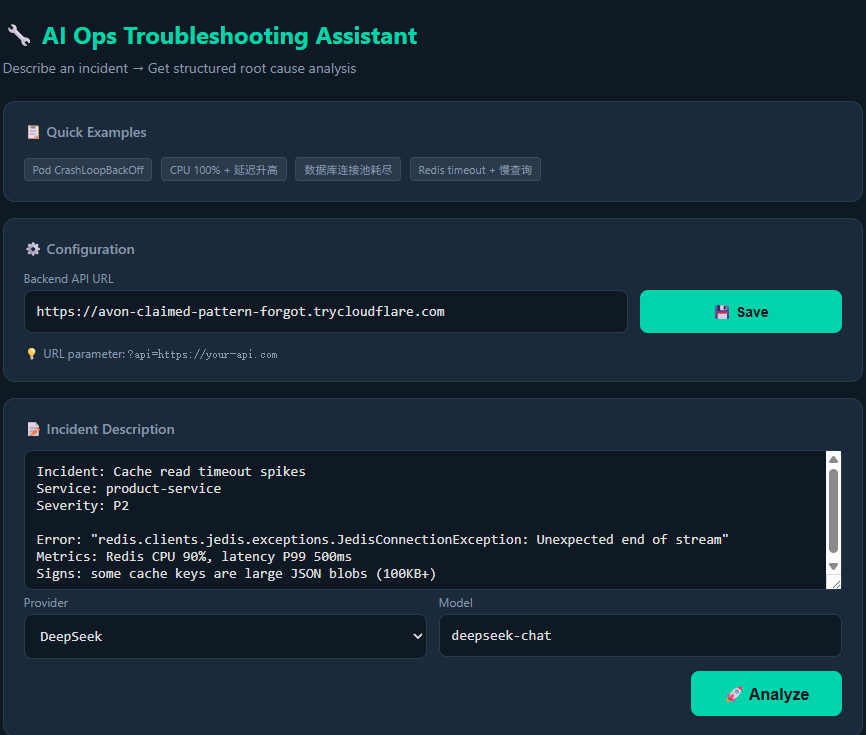
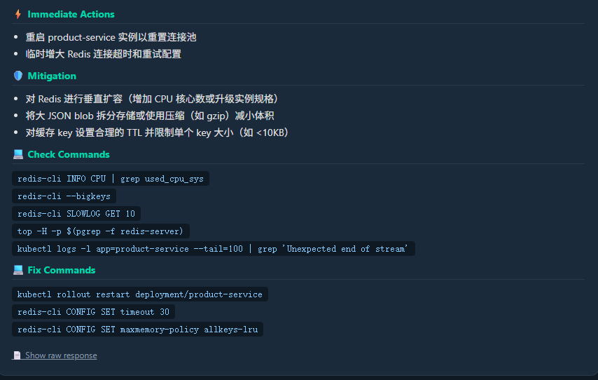
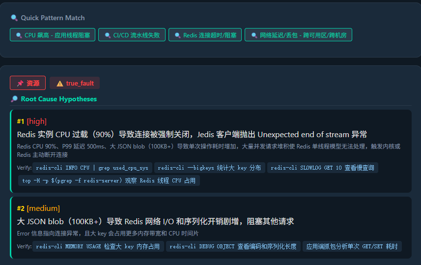

# AIOps-Wizard 🧙‍♂️🔧

**AI-powered Ops Fault Analysis Assistant — 智能运维故障分析助手**

用 AI 把告警变成可执行的排障方案。输入一条故障信息，自动匹配知识库 + DeepSeek 深度分析，秒级输出结构化根因分析、排查命令和修复步骤。

🌐 **在线体验**: https://jianminbai.github.io/AIOps-Wizard/

---

## 📸 界面展示

### 主界面 — 输入告警



粘贴告警，选择模型，一键分析。内置常见场景模板（Pod CrashLoopBackOff、CPU 100%、Redis 超时等），点一下即用。

### 诊断结果 — 从分析到行动



诊断结果分为四层：**紧急操作**（止损）→ **长期缓解**（治本）→ **排查命令**（验证根因）→ **修复命令**（解决）。每条命令可直接复制执行。

### 根因分析 — 自动知识库匹配



系统自动匹配 32 类运维知识库，按置信度排序输出根因假设，附带验证命令和证据链。高置信度匹配直接返回经验库（不调 LLM，零成本）。

---

## 🎯 这个系统能做什么？

### 核心能力

| 能力 | 说明 | 举例 |
| --- | --- | --- |
| **🔍 快速模式匹配** | 输入告警关键词，秒级命中内置知识库 | 输入 "CPU 98%" → 匹配 KB001 CPU 飙高 |
| **🧠 深度根因分析** | 调用 DeepSeek 进行上下文感知的排障推理 | "P95 3s, 连接超时, CPU 90%" → 输出 3 条根因假设 |
| **💻 可执行命令** | 每条根因附带 `kubectl`、`redis-cli`、`jstack` 等命令 | 直接复制执行，不用再搜命令 |
| **📚 32 类知识库** | 覆盖 CPU/OOM/DB/Redis/K8s/ES/Prometheus/SkyWalking/网络/MQ/CI-CD 等 | 常见运维场景全覆盖 |
| **⚡ 自动优先级** | 高置信度走 DIRECT 路由（免费），低置信度走 LLM 深度分析 | 省 token 省钱 |
| **🔒 安全防护** | API Key 认证 + 频率限制 + 双维度日额度 | 公开部署不怕滥用 |
| **🌐 前端可配置** | 支持自定义 API Endpoint，可对接任意后端 | 本地、Docker、Tunnel 都兼容 |

### 典型使用场景

**👨‍💻 值班排障**
> 收到 P0 告警 → 复制告警文字粘贴到前段 → 点 Analyze → 秒级拿到：根因假设 + 排查命令 + 修复命令 → 直接命令行执行

**📋 故障复盘**
> 每次故障解决后，用系统生成结构化分析报告，直接用于事后回顾和根因复盘

**🎓 新人 onboarding**
> 运维新人值班时，输入告警就能看到老司机写的排查步骤和修复命令，不用翻 Wiki、不用问人

**🤖 飞书/钉钉集成**
> 通过 API 对接告警机器人，告警自动触发分析，结果推送到群聊

**📈 Prometheus Alertmanager Hook**
> Alertmanager Webhook 自动转发告警到 AIOps-Wizard，实现告警即分析

---

## 🏗️ 系统架构

```
┌─────────────────────────────────────────────────────────────────┐
│                   用户访问层                                      │
│  ┌──────────────────────┐    ┌──────────────────────────────┐   │
│  │  GitHub Pages 前端    │    │  直接访问 http://ip:8766     │   │
│  │  (jianminbai.github  │    │  (内网/本地使用)              │   │
│  └──────────┬───────────┘    └──────────────┬───────────────┘   │
│             │ HTTPS                          │ HTTP              │
│             ▼                                ▼                  │
│  ┌──────────────────────────────────────────────────────────┐   │
│  │              Cloudflare Tunnel (可选)                      │   │
│  │   https://xxx.trycloudflare.com → localhost:8766          │   │
│  └──────────────────────────────────────┬───────────────────┘   │
└─────────────────────────────────────────┼───────────────────────┘
                                          ▼
┌─────────────────────────────────────────────────────────────────┐
│                    FastAPI 后端 (:8766)                           │
│                                                                  │
│  ┌──────────────┐   ┌────────────────┐   ┌──────────────────┐  │
│  │  安全中间件   │──▶│  认证/限流/配额 │──▶│   分析路由       │  │
│  │ CORS/Auth/   │   │  中间件         │   │   POST /analyze  │  │
│  │ RateLimit    │   │                │   │                  │  │
│  └──────────────┘   └────────────────┘   └────────┬─────────┘  │
│                                                    ▼            │
│  ┌──────────────────────────────────────────────────────────┐   │
│  │              分析引擎 (engine.py)                          │   │
│  │                                                           │   │
│  │  输入告警 ──▶ 知识库匹配 ──▶ 置信度计算 ──▶ 路由决策      │   │
│  │                                    │                      │   │
│  │              ┌─────────────────────┼──────────────┐       │   │
│  │              ▼                     ▼              ▼       │   │
│  │  ┌─────────────────┐ ┌──────────────────┐ ┌──────────┐   │   │
│  │  │ DIRECT (≥0.70)  │ │ CONTEXT (≥0.40) │ │ LLM_ONLY │   │   │
│  │  │ 直接返回知识库  │ │ KB上下文+LLM分析 │ │ 纯LLM    │   │   │
│  │  │ 零成本 不消耗   │ │ 消耗额度         │ │ 消耗额度  │   │   │
│  │  └─────────────────┘ └──────────────────┘ └──────────┘   │   │
│  └──────────────────────────────────────────────────────────┘   │
│                    │                                            │
│                    ▼                                            │
│  ┌──────────────────────────────────────────────────────────┐   │
│  │             知识库 (32条 YAML)                             │   │
│  │  ┌──────────┐ ┌──────────┐ ┌──────────┐ ┌──────────┐   │   │
│  │  │resource  │ │dependency│ │applica..│ │ change   │   │   │
│  │  │.yaml     │ │.yaml     │ │.yaml     │ │.yaml     │   │   │
│  │  └──────────┘ └──────────┘ └──────────┘ └──────────┘   │   │
│  │  ┌──────────┐ ┌──────────┐                               │   │
│  │  │external  │ │template  │                               │   │
│  │  │.yaml     │ │.yaml     │                               │   │
│  │  └──────────┘ └──────────┘                               │   │
│  └──────────────────────────────────────────────────────────┘   │
│                    │                                            │
│                    ▼                                            │
│  ┌──────────────────────────────────────────────────────────┐   │
│  │             DeepSeek API (cloud)                          │   │
│  │   深度分析、根因推理、修复方案生成                           │   │
│  └──────────────────────────────────────────────────────────┘   │
└─────────────────────────────────────────────────────────────────┘
```

---

## 🎁 核心好处

### 对个人工程师
- **告别查手册**：忘记命令？系统直接给你 `kubectl`、`redis-cli`、`jstack` 命令
- **快速上手**：新人值班也能像老司机一样排障
- **积累经验**：每次故障复盘写成一条 YAML，知识库越用越强

### 对团队
- **标准化排障流程**：所有人用同一套知识库，输出格式一致
- **降低 MTTR**：告警 → 分析 → 命令，全流程秒级
- **知识不流失**：人员流动，经验留在知识库里

### 对企业
- **省钱**：高置信度匹配 DIRECT 路由免费，LLM 调用有日额度控制
- **安全**：三层防护（Key + 限频 + 配额），公开部署不怕滥用
- **可扩展**：YAML 知识库，团队独立维护，API 可对接飞书/钉钉/Prometheus

---

## 🔒 安全防护

```
                  ┌─────────────────────────┐
                  │     API Key 认证         │ ← 401（没 key 直接拒绝）
                  │  Header: X-API-Key       │
                  └────────┬────────────────┘
                           ▼
                  ┌─────────────────────────┐
                  │  频率限制（每 IP）        │ ← 429（超限拒绝）
                  │  AIOPS_RATE_LIMIT        │
                  └────────┬────────────────┘
                           ▼
                  ┌─────────────────────────┐
                  │  置信度路由              │ ← DIRECT（≥0.7）免费
                  │  DIRECT / CONTEXT / LLM  │
                  └────────┬────────────────┘
                           ▼
                  ┌─────────────────────────┐
                  │  LLM 额度（双重限制）     │ ← 配额耗尽返回提示
                  │  每 IP: 30次/天          │
                  │  全局: 500次/天          │
                  └─────────────────────────┘
```

| 防护层 | 配置 | 默认值 | 说明 |
| --- | --- | --- | --- |
| API Key | `AIOPS_API_KEY` | 不设置则公开 | 所有请求需携带 `X-API-Key` 头 |
| 频率限制 | `AIOPS_RATE_LIMIT` | 5次/分钟/IP | 滑动窗口，超限返回 429 |
| 个人日额度 | `AIOPS_LLM_PER_IP_DAILY` | 30次/天 | 单 IP 用满不影响其他人 |
| 全局日额度 | `AIOPS_LLM_GLOBAL_DAILY` | 500次/天 | 所有 IP 总和的保险阀 |

> 💡 DIRECT 路由（score≥0.70）直接返回知识库，**不消耗 LLM 额度**。

---

## 🚀 快速启动

### 方式一：Python 直接运行

```bash
# 1. 安装依赖
pip install fastapi uvicorn openai pydantic httpx pyyaml

# 2. 配置环境变量
export DEEPSEEK_API_KEY="sk-xxxxxxxxxxxxxxxxxxxxxxxxxxxxxxxx"
export AIOPS_API_KEY=***     # 可选，不设置则公开访问
export AIOPS_RATE_LIMIT=5
export AIOPS_LLM_PER_IP_DAILY=30
export AIOPS_LLM_GLOBAL_DAILY=500

# 3. 启动
python3 api.py

# 4. 访问
open http://localhost:8766
```

### 方式二：Docker 部署（推荐）

```bash
# 生成 API Key
AIOPS_KEY=$(head -c 32 /dev/urandom | base64)
echo "你的 API Key: $AIOPS_KEY"

# 设置所有环境变量
export DEEPSEEK_API_KEY="sk-xxxxxxxxxxxxxxxxxxxxxxxxxxxxxxxx"
export AIOPS_API_KEY=***
export AIOPS_RATE_LIMIT=5
export AIOPS_LLM_PER_IP_DAILY=30
export AIOPS_LLM_GLOBAL_DAILY=500

# 构建并启动
docker compose build --no-cache
docker compose up -d

# 验证
curl -s http://localhost:8766/health | python3 -m json.tool
```

### 方式三：GitHub Pages + Cloudflare Tunnel（生产环境）

```bash
# 服务器端
export DEEPSEEK_API_KEY="sk-xxxxxxxxxxxxxxxxxxxxxxxxxxxxxxxx"
export AIOPS_API_KEY=***
export AIOPS_RATE_LIMIT=5
export AIOPS_LLM_PER_IP_DAILY=30
export AIOPS_LLM_GLOBAL_DAILY=500

docker compose up -d

# 启动 Cloudflare Tunnel
docker run -d --name cloudflared --restart unless-stopped \
  --network host \
  cloudflare/cloudflared tunnel --url http://localhost:8766

# 前端
open https://jianminbai.github.io/AIOps-Wizard/
```

---

## 📖 API 文档

### `POST /analyze` — 分析故障

**请求头：**
```
X-API-Key: ***          # 如果后端配置了认证
Content-Type: application/json
```

**请求体：**

```json
{
  "incident": "order-service P95 latency from 200ms to 3s, CPU 98%, 503 errors",
  "metrics": {"cpu": 98, "memory": 85},
  "logs": "2026-06-22 10:00:00 ERROR connection timeout",
  "model": "deepseek-chat",
  "force_llm": false
}
```

| 字段 | 类型 | 必填 | 说明 |
| --- | --- | --- | --- |
| `incident` | string | ✅ | 故障描述 |
| `metrics` | object | ❌ | 指标数据 |
| `logs` | string | ❌ | 日志片段 |
| `model` | string | ❌ | 模型名（默认 deepseek-chat） |
| `force_llm` | bool | ❌ | 强制走 LLM（跳过 KB） |

**响应体：**

```json
{
  "success": true,
  "confidence_route": "CONTEXT",
  "confidence_score": 0.55,
  "quota_remaining": 28,
  "quick_matches": [
    {
      "kb_id": "KB001",
      "title": "CPU 飙高 - 应用线程阻塞",
      "category": "resource"
    }
  ],
  "analysis": {
    "classification": "资源",
    "severity_assessment": "true_fault",
    "root_cause_hypotheses": [
      {
        "rank": 1,
        "cause": "CPU 资源耗尽导致请求排队",
        "probability": "high",
        "evidence": "CPU 98%, P95 latency 上升 15x",
        "verify_steps": [
          "top -H -p $(pgrep -f order-service)",
          "jstack $(pgrep -f order-service) | grep -A 20 'RUNNABLE'"
        ],
        "fix_steps": [
          "kubectl scale deployment order-service --replicas=5",
          "kubectl set resources deployment order-service --limits=cpu=2,memory=4Gi"
        ]
      }
    ],
    "immediate_actions": ["扩容 Pod 增加副本数", "重启异常实例"],
    "mitigation_suggestions": ["配置 HPA 自动扩缩容", "增加限流"],
    "commands": {
      "check": ["kubectl top pod", "top -H ..."],
      "fix": ["kubectl scale ..."]
    }
  }
}
```

### 错误码

| HTTP 状态码 | 场景 | 说明 |
| --- | --- | --- |
| 200 | 分析成功 | 正常返回 |
| 401 | 未提供 API Key | `X-API-Key` 缺失或错误 |
| 429 | 频率超限 | 当前 IP 超过 `AIOPS_RATE_LIMIT` 次/分钟 |
| 429 | 日额度耗尽 | IP 额度或全局额度用完 |
| 422 | 参数错误 | 请求体格式不对 |

### `GET /health` — 健康检查 + 配额

```json
{
  "status": "ok",
  "kb_count": 32,
  "kb_source": "yaml",
  "auth_required": true,
  "rate_limit": 5,
  "quota": {
    "my_ip": "203.0.113.1",
    "my_llm_today": 3,
    "my_llm_limit": 30,
    "my_direct_today": 12,
    "global_llm_today": 15,
    "global_llm_limit": 500,
    "remaining": 27
  }
}
```

### `GET /kb` — 知识库列表

支持筛选：`?category=resource` | `?search=cpu`

### `GET /kb/{id}` — 知识库详情

### `POST /kb` — 添加知识库

---

## 🧠 知识库

### 32 类运维场景

| ID | 类别 | 故障场景 | ID | 类别 | 故障场景 |
| --- | --- | --- | --- | --- | --- |
| KB001 | 资源 | CPU 飙高 - 应用线程阻塞 | KB017 | 依赖 | Nginx 502/504 |
| KB002 | 资源 | 内存溢出 (OOMKilled) | KB018 | 依赖 | etcd 集群不稳定 |
| KB003 | 依赖 | 数据库连接池耗尽 | KB019 | 资源 | K8s Node NotReady |
| KB004 | 依赖 | Redis 延迟飙升 | KB020 | 资源 | Pod Pending |
| KB005 | 应用 | Pod CrashLoopBackOff | KB021 | 变更 | ImagePullBackOff |
| KB006 | 资源 | 磁盘空间满 | KB022 | 资源 | TCP TIME_WAIT 积压 |
| KB007 | 外部 | 网络延迟/丢包 | KB023 | 资源 | 文件描述符耗尽 |
| KB008 | 依赖 | 消息队列积压 | KB024 | 应用 | Java 线程死锁 |
| KB009 | 应用 | 慢 SQL/数据库性能 | KB025 | 资源 | HPA 无法扩缩容 |
| KB010 | 变更 | 配置错误/发布回滚 | KB026 | 外部 | DNS 解析失败 |
| KB011 | 依赖 | ES 集群 RED | KB027 | 依赖 | ELK 摄入背压 |
| KB012 | 依赖 | Prometheus 告警风暴 | KB028 | 应用 | 熔断器触发 |
| KB013 | 应用 | SkyWalking 调用链断裂 | KB029 | 变更 | 配置中心未生效 |
| KB014 | 资源 | Docker overlay2 磁盘暴涨 | KB030 | 应用 | APM 探针泄漏 |
| KB015 | 变更 | CI/CD 流水线失败 | KB031~32 | — | 扩展预留 |
| KB016 | 变更 | SSL/TLS 证书过期 |  |  |  |

每条知识库包含 `common_causes` / `check_commands` / `fix_commands` / `keywords`，覆盖全栈运维场景。

### 置信度路由

```
score ≥ 0.70 ──→ DIRECT    直接返回知识库（不调 LLM，零成本，不消耗额度）
score ≥ 0.40 ──→ CONTEXT   知识库 + LLM 深度分析（消耗额度）
score <  0.40 ──→ LLM_ONLY 纯 LLM 分析（消耗额度）
```

### 如何扩充

编辑 YAML 文件或通过 API 添加：

```bash
cp kb/template.yaml kb/my-incident.yaml
vim kb/my-incident.yaml
# 重启 API 生效
```

---

## 🗂️ 项目结构

```
AIOps-Wizard/
├── engine.py              # 分析引擎（System Prompt + 知识库集成）
├── api.py                 # FastAPI 后端（含三层安全防护）
├── kb_loader.py           # YAML 知识库加载器
├── kb/                    # 知识库 YAML 文件
│   ├── resource.yaml      # 资源类（CPU/OOM/磁盘等）
│   ├── dependency.yaml    # 依赖类（DB/Redis/ES/MQ 等）
│   ├── application.yaml   # 应用类（CrashLoop/慢 SQL/死锁等）
│   ├── change.yaml        # 变更类（发布/CI-CD/证书等）
│   ├── external.yaml      # 外部类（网络/DNS 等）
│   └── template.yaml      # 新增条目模板
├── .llm_quota.json        # 额度持久化（重启不丢失）
├── index.html             # 本地前端
├── docs/
│   ├── index.html         # GitHub Pages 前端
│   └── images/            # 截图
├── Dockerfile
├── docker-compose.yml
├── .dockerignore
├── .github/workflows/
│   └── deploy-pages.yml   # 自动部署 Pages
└── README.md
```

---

## 🛠️ 技术栈

| 层级 | 技术 |
| --- | --- |
| **AI 引擎** | DeepSeek API |
| **后**端框架 | FastAPI + Uvicorn |
| **安全防护** | API Key 认证 + 滑动窗口限频 + 双维度日额度 |
| **知识库** | 32 类 YAML，置信度路由（DIRECT/CONTEXT/LLM_ONLY） |
| **前端** | Vanilla HTML/CSS/JS + GitHub Pages |
| **容器化** | Docker + Docker Compose |
| **CI/CD** | GitHub Actions |
| **网络** | Cloudflare Tunnel（可选） |

---

## 📋 路线图

- [x] AI 故障分析 MVP
- [x] 32 条运维知识库
- [x] YAML 知识库 + 置信度路由
- [x] Docker 打包 + GitHub Pages 前端
- [x] API Key 认证 + 频率限制 + 日额度
- [ ] 飞书/钉钉机器人集成
- [ ] Prometheus Alertmanager Webhook
- [ ] 知识库扩充至 50+ 条
- [ ] 多模型支持（Claude / GPT）

---

## 📄 许可证

MIT License

---

*Made with ❤️ by jianminbai — 把排障经验变成产品*
